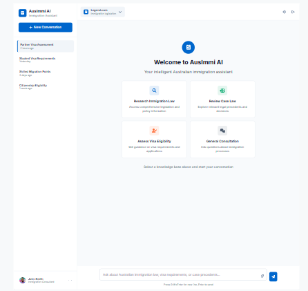

# UI Redesign Complete ✨

## Overview

The UI has been successfully redesigned to match the Ausimmi AI design reference with **zero changes** to backend functionality.



## What's New

### 🎨 Modern Interface

- **Sidebar Navigation**: Clean, icon-based navigation for knowledge bases
- **Welcome Screen**: Engaging start screen with action cards
- **Dark Mode**: Built-in theme toggle with system preference support
- **shadcn/ui Components**: Professional, accessible component library

### 🔄 Smart Workflow Switching

When you select a different knowledge base:
1. App detects the change
2. ChatKit session automatically resets
3. New session created with the appropriate workflow
4. Chat interface ready for the new context

**All backend session management is preserved and working!**

## Quick Start

### 1. Install Dependencies (Already Done)

```bash
npm install
```

### 2. Configure Environment

Update your `.env.local` with multiple workflows:

```bash
OPENAI_API_KEY=your_key_here

# Configure different workflows for each knowledge base
NEXT_PUBLIC_CHATKIT_WORKFLOWS="Policy Assessment:wf_policy123,Student Visa:wf_visa456,Higher Points:wf_points789,Consumer Registry:wf_registry012"
```

### 3. Run the App

```bash
npm run dev
```

Visit http://localhost:3000

### 4. Test the Features

1. **Welcome Screen**: You'll see the welcome screen with 4 action cards
2. **Click a Card**: Try "Assess Visa Eligibility" - it navigates to the Visa knowledge base
3. **Sidebar Navigation**: Click different knowledge bases in the sidebar
4. **Theme Toggle**: Click the sun/moon icon to switch themes
5. **New Conversation**: Click "New Conversation" to return to the welcome screen

## Architecture Highlights

### Session Management (Unchanged)

The existing session management is fully preserved:

```typescript
// app/api/create-session/route.ts - No changes
export async function POST(request: Request): Promise<Response> {
  // Session creation logic intact
  // Cookie handling intact
  // OpenAI API integration intact
}
```

### Workflow Switching (Automatic)

```typescript
// components/ChatKitPanel.tsx (lines 164-169)
useEffect(() => {
  if (previousWorkflowIdRef.current !== workflowId) {
    previousWorkflowIdRef.current = workflowId;
    handleResetChat(); // Automatic session reset
  }
}, [workflowId, handleResetChat]);
```

### Knowledge Base Mapping

```typescript
// app/App.tsx
const handleKnowledgeBaseChange = (id: string) => {
  // Map knowledge base to workflow
  const matchedWorkflow = WORKFLOW_OPTIONS.find(
    (w) => w.id.toLowerCase().includes(id.toLowerCase())
  );

  if (matchedWorkflow) {
    setWorkflowId(matchedWorkflow.id); // Triggers session reset
  }
};
```

## Customization

### Add/Edit Knowledge Bases

**lib/config.ts**:
```typescript
export const KNOWLEDGE_BASES = [
  { id: "new", label: "New Conversation", icon: "plus" },
  { id: "policy", label: "Policy Text Assessment", icon: "file-text" },
  // Add your own
  { id: "custom", label: "Custom KB", icon: "star" },
]
```

### Add/Edit Action Cards

**lib/config.ts**:
```typescript
export const ACTION_CARDS = [
  {
    id: "research",
    label: "Research Using eCas Law",
    description: "Research using eCas law database",
    icon: "search",
  },
  // Add your own
]
```

### Customize Theme

**app/globals.css** - Modify CSS variables:
```css
:root {
  --primary: oklch(0.205 0 0);  /* Primary color */
  --accent: oklch(0.97 0 0);    /* Accent color */
  /* etc... */
}
```

## Component Overview

### AppSidebar

Location: `components/AppSidebar.tsx`

Features:
- Brand header with logo
- Knowledge base navigation buttons
- Theme toggle (light/dark)
- User profile footer
- Settings button

Props:
```typescript
{
  selectedKnowledgeBase: string;
  onKnowledgeBaseChange: (id: string) => void;
  theme: ColorScheme;
  onThemeToggle: () => void;
}
```

### WelcomeScreen

Location: `components/WelcomeScreen.tsx`

Features:
- Welcome header with icon
- 4 action cards in responsive grid
- Click-to-navigate functionality
- Smooth hover animations

Props:
```typescript
{
  onActionClick: (actionId: string) => void;
}
```

### App (Main Component)

Location: `app/App.tsx`

Features:
- Sidebar layout management
- Knowledge base state
- Workflow switching logic
- Welcome screen toggle
- Theme management

State:
```typescript
{
  workflowId: string;              // Current workflow ID
  selectedKnowledgeBase: string;   // Current KB selection
  showChat: boolean;               // Show chat or welcome screen
}
```

## File Structure

```
.
├── app/
│   ├── api/create-session/route.ts  ✅ Unchanged
│   ├── App.tsx                       ✨ Redesigned
│   ├── layout.tsx                    ✅ Unchanged
│   └── globals.css                   ✨ Updated (theme)
├── components/
│   ├── AppSidebar.tsx               ✨ New
│   ├── WelcomeScreen.tsx            ✨ New
│   ├── ChatKitPanel.tsx             ✅ Unchanged
│   ├── ErrorOverlay.tsx             ✅ Unchanged
│   └── ui/                          ✨ New (shadcn)
├── lib/
│   ├── config.ts                    ✨ Enhanced
│   └── utils.ts                     ✨ New (shadcn)
└── hooks/
    └── useColorScheme.ts            ✅ Unchanged
```

Legend:
- ✨ = New or significantly updated
- ✅ = Unchanged (backend preserved)

## Testing Checklist

- [x] Build completes without errors (`npm run build`)
- [x] Dev server starts successfully (`npm run dev`)
- [x] Welcome screen displays on load
- [ ] Action cards navigate to correct knowledge bases
- [ ] Sidebar navigation switches knowledge bases
- [ ] Theme toggle works (light/dark)
- [ ] New Conversation resets to welcome screen
- [ ] Session creation logs appear in console
- [ ] ChatKit initializes with correct workflow

## Deployment

1. **Build for Production**:
   ```bash
   npm run build
   ```

2. **Add Domain to Allowlist**:
   - Go to [Domain Allowlist](https://platform.openai.com/settings/organization/security/domain-allowlist)
   - Add your deployment domain

3. **Deploy**:
   ```bash
   npm run start  # Or deploy to Vercel, Netlify, etc.
   ```

## Documentation

- **UI_IMPLEMENTATION.md**: Detailed technical documentation
- **CHANGES_SUMMARY.md**: Complete list of changes
- **CLAUDE.md**: Architecture and development guide
- **README.md**: Original ChatKit starter template docs

## Troubleshooting

### Sessions Not Switching

Check console logs:
```typescript
[ChatKitPanel] getClientSecret invoked {
  workflowId: "wf_...",
  endpoint: "/api/create-session"
}
```

### Theme Not Persisting

Check localStorage in DevTools:
- Key: `chatkit-color-scheme`
- Value: `"light"` or `"dark"`

### Build Errors

Run type check:
```bash
npx tsc --noEmit
```

## Support

Questions? Check the docs:
- [ChatKit Docs](https://openai.github.io/chatkit-js/)
- [shadcn/ui Docs](https://ui.shadcn.com/)
- [Next.js Docs](https://nextjs.org/docs)

---

**Status**: ✅ Ready for Production

**Build**: ✅ Passing

**Backend**: ✅ Fully Preserved

**Dev Server**: ✅ Running on http://localhost:3000
